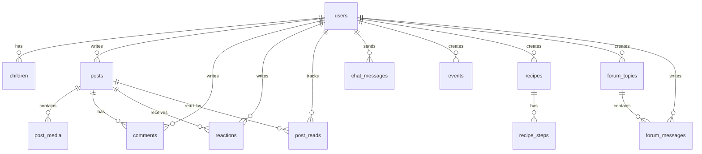

# ERD (Mermaid)

```mermaid
erDiagram
  users ||--o{ children : has
  users ||--o{ posts : writes
  posts ||--o{ post_media : contains
  posts ||--o{ comments : has
  users ||--o{ comments : writes
  posts ||--o{ reactions : receives
  users ||--o{ reactions : writes
  users ||--o{ post_reads : tracks
  posts ||--o{ post_reads : read_by
  users ||--o{ chat_messages : sends
  users ||--o{ events : creates
  users ||--o{ recipes : creates
  recipes ||--o{ recipe_steps : has
  users ||--o{ forum_topics : creates
  forum_topics ||--o{ forum_messages : contains
  users ||--o{ forum_messages : writes
```
